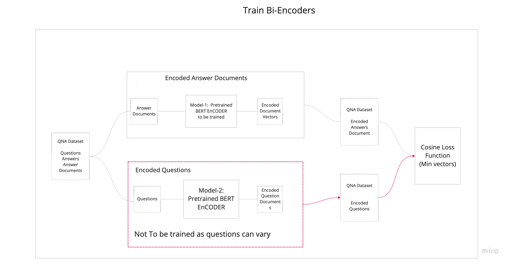
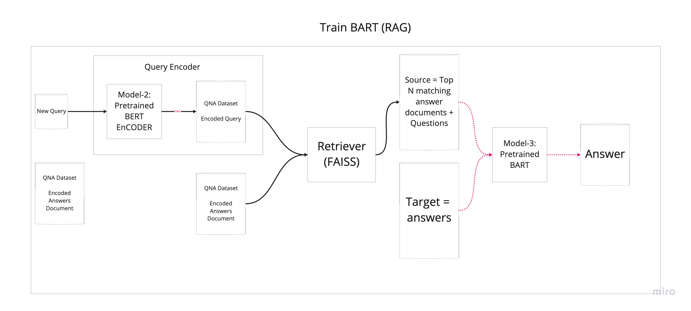
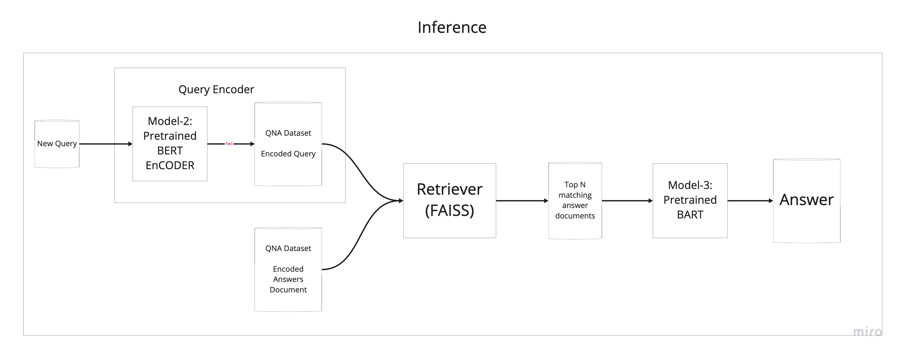
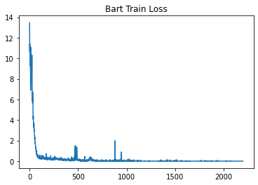
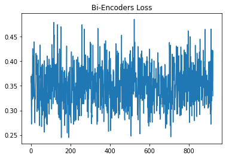

# X-RAG
RAG with a Swag!!!
> Submitted By - Naman Shrimali

## Bi-Encoders Model
- [Colab implementation](notebooks/qna_BERT_train.ipynb)
 - Two <a href='https://huggingface.co/transformers/model_doc/bert.html'>HuggingFace BERT-base pretrained models</a> for encoding Question and Answer
 - Parameters for Context doucments are freezed
 - Only question models parameters are trained
 - The CLS token outputs of both the models are compared using Cosine Similarity Function 
 - Custom dataloader pipeline is written to support this hybrid architecture
- Models Hyperparameters
    - Loss - Cosine Loss
    - Optimizer - AdamW
    - BATCH_SIZE - 3


### Architecture Diagram


### Model Code Implemtation
```python
class Question_Model(torch.nn.Module):
    def __init__(self):
        super(Question_Model, self).__init__()
        self.question_model = BertModel.from_pretrained('bert-base-uncased')
    
    def forward(self, input_ids, attention_mask):
        question_outputs = self.question_model(input_ids, attention_mask)
        return question_outputs


class Context_Model(torch.nn.Module):
    def __init__(self):
        super(Context_Model, self).__init__()
        self.context_model = BertModel.from_pretrained('bert-base-uncased')
    
    def forward(self, input_ids, attention_mask):
        context_outputs = self.context_model(input_ids, attention_mask)
        return context_outputs


class EnsembleTokens(torch.nn.Module):
    def __init__(self):
        super(EnsembleTokens, self).__init__()
        self.question_model = Question_Model().to(device)
        self.context_model = Context_Model().to(device)

        # Freezing context model's params
        for param in list(self.context_model.children()):
            param.requires_grad = False

    
    def forward(self, encoding, mode='train'):

        if mode == 'train':
            question_encoded = self.question_model(encoding['input_ids_questions'].to(device), encoding['attention_mask_questions'].to(device))
            context_encoded = self.context_model(encoding['input_ids_context'].to(device), encoding['attention_mask_context'].to(device))
            return question_encoded, context_encoded

        if mode == 'inference':
            question_encoded = self.question_model(encoding['input_ids_questions'].to(device), encoding['attention_mask_questions'].to(device))
            return question_encoded
```

## BART Model
- [Colab implementation](notebooks/qna_BARTmodel_train.ipynb)
- <a href='https://huggingface.co/transformers/model_doc/bart.html'>HuggingFace BART model</a> is trained on Questions + 2 Similar Contexts (Cuda out of memory in case of 3 contexts)
- Custom dataloader pipeline
    - Convert the question sentence to BERT encodings
    - Load saved extract of BERT encodings of all contexts in dataset (11k Unique Contexts)
    - Retrieve top 2 matching context documents using FAISS. (Note- Top 3 results in CUDA memory errors)

### Architecture Diagram


### Model Code Implemtation
```python
class BARTTrain(torch.nn.Module):
    def __init__(self):
        super(BARTTrain, self).__init__()
        self.model = BartForConditionalGeneration.from_pretrained('facebook/bart-base')
    
    def forward(self, encodings, mode):
        if mode == 'train':
            model_outputs = self.model(
                input_ids=encodings['input_ids_source_merged'].to(device), 
                attention_mask=encodings['attention_mask_source_merged'].to(device),
                decoder_input_ids=encodings['input_ids_target'].to(device),
                decoder_attention_mask=encodings['attention_mask_target'].to(device),
                labels=encodings['input_ids_target'].to(device))
        else:
            model_outputs = self.model.generate(encodings)     

        return model_outputs
```


## Inference
[Colab implementation](new_inference.ipynb)
- Question Input is taken from User
- Input is converted into BERT based encoding using Pretrained BERT question model
- BERT based question's context is matched with similar context and top 2 context is retrieved
- This output is then sent to BART based encoder for retrieval

### Architecture Diagram


### Code Insight
```python

def inference(question, bart_tokenizer, bart_model):

    # Get Pretrained BERT encodings

    ge = GetEncodings(type='questions')
    encoded_question = ge.encode(question, max_length=30)

    # Find top matching documents
    ss = SearchSimilar(iterator = df_context['context'].values.tolist(), filename='index.bin', embeddings=model_op, shape=768, device=device)
    similar_contexts = ss.get_n_similar_vectors(encoded_question, 3)
    similar_contexts.insert(0, question)

    combined_tokens = '</s></s>'.join(similar_contexts)

    print(f'Top similar document outputs is {combined_tokens}')

    # Prepare data for BART Inferencing

    source_encoding = tokenizer(
            combined_tokens,
            max_length=1024,
            padding='max_length',
            add_special_tokens=True,
            truncation=True,
            return_tensors="pt")
   

    # Inference BART Model
    output = bart_model(source_encoding['input_ids'].to(device), mode = 'eval')
    output = tokenizer.decode(output[0])
    print(output)
    return output
```


## Results

Training Loss for BART



Training Loss for BI-Encoders



## Challenges

- The main challeges are faced with the infra. Its difficult to load models and dataset and train
- After Cleanup almost 25k (Question, answers, encodings) are retrieved
- Traing 25k on BART is taking 5.5 hrs for each epoch
- For inferencing, Loading both BERT Ensemble and BART model on same colab environment is difficult, hence encodings are stored seperately
- Currently working on a sample data
- Currently showcased a complete pipeline, model needs to be trained more to show correct outputs